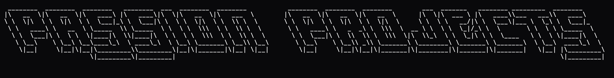

  

A collection of my **personal engineering and research projects** exploring ideas in:

- algorithms
- robotics
- embedded systems
- hardware design
- computer vision
- artificial intelligence
- scientific computing

Most of these projects were developed as **independent experiments, course extensions, or research explorations**.

Projects are listed in **reverse chronological order (newest first)**.

---

# Projects

### (~_~) SAT Fusion — Sensor Fusion with SAT Solvers
A lightweight **SAT-based decision engine** for embedded sensor fusion.

The system integrates:
- IMU for tumbling detection
- ultrasonic sensing for obstacle detection
- dual IR sensors for path following

A **servo-based haptic feedback system** communicates navigation decisions to the user.  
Designed as a prototype assistive navigation system for **visually impaired mobility**.

---

### [::] Particle Swarm Optimization — Car Simulation
A simulation framework exploring **Particle Swarm Optimization (PSO)** applied to vehicle control and trajectory optimization.

Focus areas:
- swarm intelligence
- distributed optimization
- nonlinear control behavior

---

### <*> Dummy QPU vs CPU Factorization Benchmark
A classical multithreaded benchmark comparing **CPU-based factorization** with **quantum-inspired computational models**.

Designed as a conceptual exploration of:
- QPU-style computation
- hybrid classical architectures
- multithreaded performance scaling

---

### /\ RRT Visualization and Implementation
Implementation and visualization of **Rapidly-exploring Random Trees (RRT)**.

Applications:
- robotic motion planning
- high-dimensional search spaces
- autonomous navigation

Includes graphical visualization of the search tree expansion.

---

### [|||] RISC-V Architecture in Verilog
Implementation of a simplified **RISC-V processor architecture** in Verilog.

Focus areas:
- instruction decoding
- pipeline design
- hardware logic implementation

---

### [ ][ ] 2D Convolution Engine in Verilog
A hardware implementation of **2D convolution operations** commonly used in image processing.

Applications:
- FPGA image filtering
- convolution acceleration
- computer vision preprocessing

---

### (o-o) Simple QPU Instruction Emulator
A conceptual emulator for **quantum-inspired instruction sets** running on classical hardware.

Explores:
- hybrid instruction models
- alternative computational abstractions

---

### >>> FFT Verilog Architecture
Hardware implementation of a **Fast Fourier Transform (FFT)** architecture.

Includes benchmarking against:
- MATLAB FFT implementations
- numerical accuracy comparisons

---

### [=^=] Lane Following Simulation — Kalman Filter Passivity Control
Simulation of autonomous lane tracking using:

- Kalman filtering
- passivity-based control techniques

Designed as a control systems exploration for **autonomous vehicle navigation**.

---

### /\ Borůvka-Based Feature Extraction
Experimental computer vision method inspired by **Borůvka’s algorithm**.

Focus areas:
- graph-based feature extraction
- parallelizable image segmentation
- algorithmic vision pipelines

---

### [0_0] Autonomous Maze Solver Robot
A **1:10 scale three-wheeled robot** capable of solving acyclic mazes.

Key ideas:
- quantum-inspired wall-following logic
- autonomous path exploration
- embedded robotics control

---

### <*> Quantum Graph Baseline
Experimental framework exploring **graph structures inspired by quantum computation models**.

---

### [+++] Multithreaded Matrix Multiplication and Compression
Parallel matrix multiplication experiments combined with compression techniques to explore:

- high-performance computing
- algorithmic optimization
- memory-efficient linear algebra

---

### (•‿•) Particle Physics Neural Networks
Application of neural networks to **particle physics simulations** using:

- PYTHIA
- ROOT
- TensorFlow

Inspired by workflows used in **CERN research environments**.

---

### [CNN] Custom Educational Convolutional Neural Network
A **from-scratch CNN implementation** designed for educational understanding of deep learning mechanics.

---

### |==> Telescope Balance Controller
A feedback controller for **stabilizing telescope orientation** during observation.

---

###  _
 ( )
(_)
Real-Time Moon Positioning for Telescope Tracking

Astronomical computation module that determines **real-time lunar position** to guide telescope tracking.

---

### [WEB] Personal Portfolio Website
A personal portfolio website showcasing projects, experiments, and research explorations.

---

### [MC] Monte Carlo Approach to the Specker Game
Course project developed at **ECE NTUA** exploring probabilistic strategies using Monte Carlo simulations.

---

# Areas of Exploration

Across these projects I explore topics including:

- robotics and autonomous systems
- embedded systems
- hardware design (Verilog / FPGA concepts)
- optimization algorithms
- quantum-inspired computing
- computer vision
- artificial intelligence
- computational physics
- scientific simulation

---

More experiments and research prototypes will be added over time.
